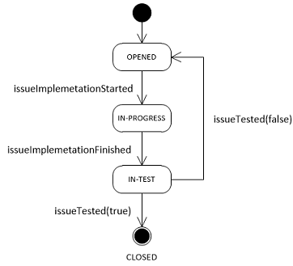

# orbitoo-toolkit: Advanced Guide (IN-PROGRESS)

The advanced guide contains several patterns, in order to show how to implement:
* [the service callback](#The-Service-Callback)
* [the application workflow](#The-Application-Workflow)

The concrete application can adapt these patterns to its specific context.

## The Service Callback
Callbacks allows us to compose the larger activity from smaller activities. For example we can have the entity,
which represents customer's `Order`. During processing of `Order` we will need to perform the payment,
which is represented by `Payment` entity. Once the customer finishes `Payment` we need to notify `Order`,
which will continue with its processing.

First it is necessary to define an entity for the service reference:

```java
@AllArgsConstructor
@Getter
@Setter
public class ServiceRef {
    @Tag(name = "value")
    private String value = null;
}
```

Then we need to define callback `@ServicePoint` with a service reference as `@Subject`:

```java
@ServicePoint("paymentCallback")
public interface PaymentCallback {
    public void paymentExecuted(String paymentId, @Subject ServiceRef serviceRef);
}
```

After that we should be able to send the callback from our `PaymentService`:

```java
@Service
public class PaymentServiceImpl implements PaymentService {
    @Autowired
    @ServicePointReference
    private PaymentCallback paymentCallback;

    @Async
    @Override
    public void executePayment(String paymentId, BigDecimal amount, ServiceRef callbackRef) {
        ...
        // send the callback
        paymentCallback.paymentExecuted(paymentId, callbackRef);
    }
}
```

Finally we can invoke `PaymentService` from `OrderService` and process the callback.
This will be done in three steps:
* first we will choose an unique service reference
* then we will invoke `PaymentService` with the chosen service reference
* finally we will specify callback `@Bean` and we will bind it to the chosen service reference

```java
@Slf4j
@Service
public class OrderServiceImpl implements OrderService {
    private static final String ORDER_PAYMENT_CALLBACK = "OrderServiceImpl#PaymentCallback";

    @Autowired
    private PaymentService paymentService;

    @Override
    public void orderPayment(String orderId) {
        log.info("orderPayment started: " + orderId);
        paymentService.executePayment(orderId, new BigDecimal("4999.00"), new ServiceRef(ORDER_PAYMENT_CALLBACK));
    }

    @Bean
    @DomainService(servicePointName = "paymentCallback", subjectClass = ServiceRef.class, //
            subjectTaggedValues = @TaggedValue(tag = "value", value = ORDER_PAYMENT_CALLBACK))
    public PaymentCallback getOrderPaymentCallback() {
        return (paymentId, serviceRef) -> log.info("orderPayment finished: " + paymentId);
    }
}
```

Output:

```
orderPayment started: ORDER-2023-01-01-0001
orderPayment finished: ORDER-2023-01-01-0001
```

## The Application Workflow
The following paragraph describes, how to implement a simple workflow with help of the toolkit.

Let's imagine, that we are developing a system, which will manages issues (like JIRA).
The information about the issues will be stored in our database.
Additional the system will have to manage several types of the issues:

```java
public enum IssueType {
    TASK, BUG
}

@Slf4j
@Getter
@Setter
public class Issue {
    private String id = null;

    @Tag(name = "type", priority = 2)
    private IssueType type = null;

    @Tag(name = "state", priority = 1)
    private String state = null;
}
```

We want to implement the following workflow for our **tasks**:<br>


First we will define `@ServicePoint`, which will contain API for all **issues**.<br>
It will also expose method **entryState**, which will be used internally for transaction between states.

```java
@ServicePoint("issueServicePoint")
public interface IssueService {
    public void entryState(@Subject Issue issue);

    public default void issueImplementationStarted(@Subject Issue issue) {
        throw new IllegalStateException();
    }

    public default void issueImplementationFinished(@Subject Issue issue) {
        throw new IllegalStateException();
    }

    public default void issueTested(@Subject Issue issue, boolean testPassed) {
        throw new IllegalStateException();
    }
}
```

Then we can start to implement **task** workflow in service `TaskServiceImpl`.<br>
In our case the state will be represented by `DomainService`, which will be bound to our @ServicePoint,
**task** issue type and to the issue state.<br>
<br>
In order to make the code more simple, we will implement merged annotation `@State` and `@Ref`:

```java
    @Retention(RetentionPolicy.RUNTIME)
    @Bean
    @DomainService( //
            servicePointName = "issueServicePoint", subjectClass = Issue.class, //
            subjectTaggedValues = @TaggedValue(tag = "type", value = "TASK") //
    )
    public static @interface State {
        @AliasFor(annotation = DomainService.class, attribute = "additionalTaggedValues")
        public TaggedValue[] value();
    }

    @Retention(RetentionPolicy.RUNTIME)
    @Autowired
    @Qualifier
    @Lazy
    public static @interface Ref {
        @AliasFor(annotation = Qualifier.class, attribute = "value")
        public String value();
    }
```

Then we can start to define states with transitions and business logic:

```java
    @State(@TaggedValue(tag = "state", value = "OPENED"))
    public IssueService getTaskOpenedService(@Ref("getTaskInProgressService") IssueService taskInProgressService) {
        return new IssueService() {
            @Override
            public void entryState(Issue issue) {
                issue.setState("OPENED");
            }

            @Override
            public void issueImplementationStarted(Issue issue) {
                log.info("issueImplementationStarted: " + issue.getId());
                taskInProgressService.entryState(issue);
            }
        };
    }

    @State(@TaggedValue(tag = "state", value = "IN-PROGRESS"))
    public IssueService getTaskInProgressService(@Ref("getTaskInTestService") IssueService taskInTestService) {
        return new IssueService() {
            @Override
            public void entryState(Issue issue) {
                issue.setState("IN-PROGRESS");
            }

            @Override
            public void issueImplementationFinished(Issue issue) {
                log.info("issueImplementationFinished: " + issue.getId());
                taskInTestService.entryState(issue);
            }
        };
    }

    @State(@TaggedValue(tag = "state", value = "IN-TEST"))
    public IssueService getTaskInTestService( //
            @Ref("getTaskOpenedService") IssueService taskOpenedService, //
            @Ref("getTaskClosedService") IssueService taskClosedService //
    ) {
        return new IssueService() {
            @Override
            public void entryState(Issue issue) {
                issue.setState("IN-TEST");
            }

            @Override
            public void issueTested(Issue issue, boolean testPassed) {
                log.info("issueTested: " + issue.getId() + ", " + testPassed);
                if (testPassed) {
                    taskClosedService.entryState(issue);
                } else {
                    taskOpenedService.entryState(issue);
                }
            }
        };
    }

    @State(@TaggedValue(tag = "state", value = "CLOSED"))
    public IssueService getTaskClosedService() {
        return issue -> issue.setState("CLOSED");
    }
```

